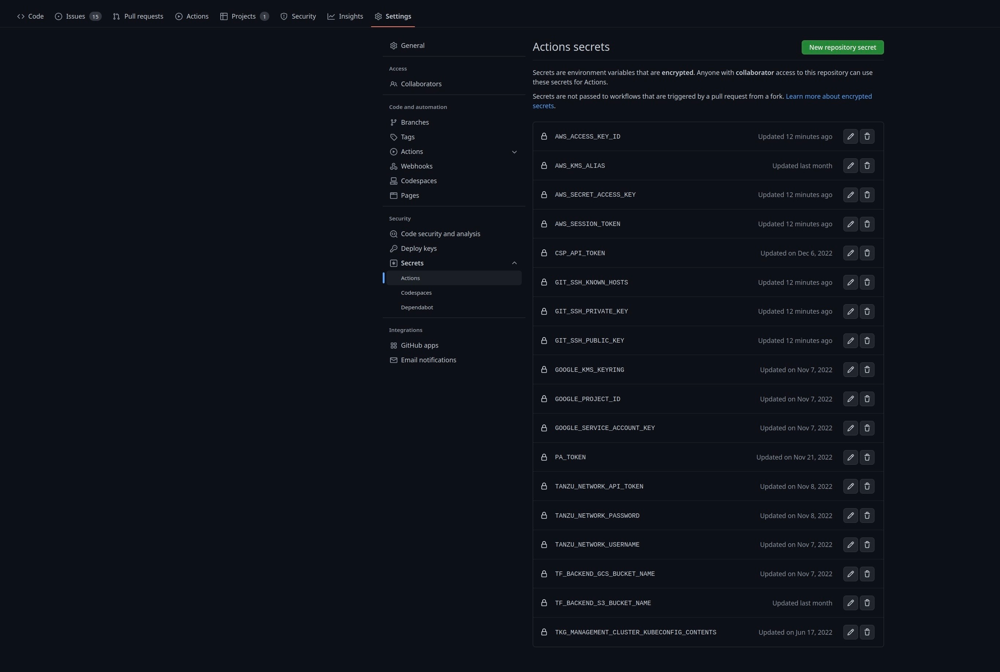

# Tanzu Application Platform Installation Automation

## Table of Contents

* [Prerequisites](#prerequisites)
  * [Fork this repository](#fork-this-repository)
  * [Setup a Personal Access Token in Github](#setup-a-personal-access-token-in-github)
  * [Establish accounts on VMware sites](#establish-accounts-on-vmware-sites)
  * [Configure Github Secrets](#configure-github-secrets)
  * [Create Gitops repositories for your K8s configuration and deliverables](#create-gitops-repositories-for-your-k8s-configuration-and-deliverables)
  * [Domain setup](#domain-setup)
* [Lifecycle Management](#lifecycle-management)
  * [Requirements](#requirements)
  * [Install](#install)
  * [Uninstall](#uninstall)
  * [Multi-cluster](#multi-cluster)
  * [Behind the scenes](#behind-the-scenes)
* [Related resources](#related-resources)


## Prerequisites

### Fork this repository

If you haven't already, fork this GitHub repository and enable the GitHub Actions it contains.

```bash
#! with gh CLI
gh repo fork pacphi/gha-workflows-with-gitops-for-tanzu-application-platform
```

You will also need to search-and-replace occurrences of:

```yaml
url: git@github.com:pacphi/gha-workflows-with-gitops-for-tanzu-application-platform
```

within `.yml` and `.tpl` files located in sub-directories under the [gitops/tanzu](../gitops/tanzu) directory.

Note that the URL above references this Github repository.  You'll want to update it to point to your fork.  Simply replace `pacphi` above with your Github id.

Then commit:

```
git add .
git commit -m "Update spec.fetch.git.url in App CRs so that k8s manifests are fetched from fork"
git push
```

To keep your fork up-to-date with upstream changes

```bash
git remote add upstream https://github.com/pacphi/gha-workflows-with-gitops-for-tanzu-application-platform
```
> Execute once


```bash
#! with git CLI
git fetch upstream
git merge upstream/main
git push

#! alternatively with gh CLI
gh repo sync --source pacphi/gha-workflows-with-gitops-for-tanzu-application-platform
```
> Execute periodically


### Setup a Personal Access Token in Github

A PAT is required so that workflows can add secrets to the repository in order to be used in downstream jobs.  Documentation can be found [here](https://docs.github.com/en/authentication/keeping-your-account-and-data-secure/creating-a-personal-access-token).


### Establish accounts on VMware sites

You will need to setup accounts on

* [Tanzu Network](https://login.run.pivotal.io/login)
  > Click on the Create Account link
* [VMware Marketplace](https://marketplace.cloud.vmware.com/)
  > Click on the Create Marketplace Account link

Store your account credentials, they will be required in the next step.


### Configure Github Secrets

Ensure you have added secrets for your target cloud operating environment

* [AWS](AWS.md#configure-github-secrets)
* [Azure](AZURE.md#configure-github-secrets)
* [Google](GOOGLE.md#configure-github-secrets)

Then add the following secrets

```bash
# Legacy API token for account on Tanzu Network
export TANZU_NETWORK_API_TOKEN= 
# Tanzu Network account username
export TANZU_NETWORK_USERNAME= 
# Tanzu Network account password
export TANZU_NETWORK_PASSWORD= 
# VMware Cloud Service Platform API Token, used for authenticating to the VMware Marketplace
export CSP_API_TOKEN= 
```
> Use the [gh-secrets-setup.sh](../scripts/gh-set-secrets.sh) with the `--include-tanzu-secrets` option to store these values in Github secrets.

```bash
# (Optional) OIDC authentication provider and credentials - if set, login to TAP GUI is restricted to authorized users
# The combo below are utilized to determine activation in gitops/tanzu/application-platform/profiles/base [tap-values-full.yml, tap-values-view.yml]
export OIDC_AUTH_PROVIDER=github
export OIDC_AUTH_CLIENT_ID=""
export OIDC_AUTH_CLIENT_SECRET=""
```
> Use the [gh-secrets-setup.sh](../scripts/gh-set-secrets.sh) with the `--include-oidc-credentials` option to store these values in Github secrets.

<details>

  
</details>


### Create Gitops repositories for your K8s configuration and deliverables

```bash
#! Repository hosting Kubernetes configuration (e.g., Knative Service, K8s Service/Deployment) in a predefined nested folder hierarchy: config/{workload-namespace}/{workload}.
gh repo create tap-gitops-depot --private
```
> Note: if you change the name of this repo you will need to search-and-replace occurrences of `tap-gitops-depot` in your fork with the new name and then commit the updates.

```bash
#! Repository where application deliverables are managed. Deliverables target configuration from depot to be deployed to a Kubernetes cluster.
gh repo create tap-gitops-deliverables --private
```

### Domain setup

Once TAP is installed you will be able to access components and workloads from your browser.
Install automation configuration (as-designed) expects that you'll manage a domain and/or subdomains in a DNS provider.

#### Single-cluster, full profile footprint

1 zone hosting domain's A or CNAME records

```bash
#! Addressable URLs
https://tap-gui.{domain}
https://api-portal.{domain}
https://learning-center-guided.{domain}
https://{workload}.{domain}
```

#### Multi-cluster footprint

Opt for assigning a subdomain per cluster (excluding cluster hosting build profile)

```bash
#! Addressable URLs
https://tap-gui.{view}.{domain}
https://api-portal.{view}.{domain}
https://learning-center-guided.{view}.{domain}
https://{workload}.{iterate}.{domain}
https://{workload}.{run[1..N]}.{domain}
```

3 zones hosting each subdomain's A or CNAME records

It's helpful to create a root zone for the base domain and then a zone per subdomain to manage records
When opting for this approach you'll create NS records for each zone (subdomain) in the root zone.

You'll also want to create a service account or role and assign appropriate permissions (policy) to read and write records into the(se) zone(s).
Each cluster will have contour, cert-manager and external-dns installed.  Both the ClusterIssuer and the external-dns controller rely on a Secret where the credentials for the service account or role are encapsulated.


## Lifecycle Management

Under Github Actions, manually trigger one more of the following dispatch workflows to _install_ or _uninstall_ Tanzu Application Platform

### Requirements

For each non TKG cluster

* [install-tanzu-cluster-essentials-dispatch](../../../actions/workflows/install-tanzu-cluster-essentials-dispatch.yml)
* [install-tanzu-standard-repo-dispatch](../../../actions/workflows/install-tanzu-standard-repo-dispatch.yml)

For each cluster that will host a TAP profile

* [install-tanzu-data-services-repo-dispatch](../../../actions/workflows/install-tanzu-data-services-repo-dispatch.yml)
* [install-tanzu-ingress-dispatch](../../../actions/workflows/install-tanzu-ingress-dispatch.yml)

> If you used any of the provisioning automation (i.e., cloud -cluster or -e2e flows) the above requisite packages get installed.

### Install

For each cluster

* [install-tanzu-application-platform-dispatch](../../../actions/workflows/install-tanzu-application-platform-dispatch.yml)

### Uninstall

For each cluster

* [uninstall-tanzu-application-platform-dispatch](../../../actions/workflows/uninstall-tanzu-application-platform-dispatch.yml)

For each cluster hosting a TAP profile

* [uninstall-tanzu-ingress-dispatch](../../../actions/workflows/uninstall-tanzu-ingress-dispatch.yml)
* [uninstall-tanzu-data-services-repo-dispatch](../../../actions/workflows/uninstall-tanzu-data-services-repo-dispatch.yml)

For each non TKG cluster

* [uninstall-tanzu-standard-repo-dispatch](../../../actions/workflows/uninstall-tanzu-standard-repo-dispatch.yml)

> If you used any of the provisioning automation (i.e., cloud -cluster or -e2e flows) the above requisite packages get uninstalled; however, Cluster Essentials for VMware Tanzu will remain installed.

### Multi-cluster

These workflows serve to speed your installation of a multi-cluster footprint of Tanzu Application Platform.

Currently supported target clouds: [ AWS, Azure, Google ]

* [multi-cluster-tanzu-application-platform-install-on-aws-dispatch](../../../actions/workflows/multi-cluster-tanzu-application-platform-install-on-aws-dispatch.yml)
* [multi-cluster-tanzu-application-platform-install-on-azure-dispatch](../../../actions/workflows/multi-cluster-tanzu-application-platform-install-on-azure-dispatch.yml)
* [multi-cluster-tanzu-application-platform-install-on-google-dispatch](../../../actions/workflows/multi-cluster-tanzu-application-platform-install-on-google-dispatch.yml)

### Behind the scenes

There are two types of actions defined, those that can be manually triggered (i.e., dispatched), and those that can only be called by another action.  All actions above are located [here](../../../actions) and can be run by providing the required parameters.  Go [here](../.github/workflows) to inspect the source for each action.

We're employing a mix of declarative ([GitOps](https://opengitops.dev/#principles)) and imperative approaches to get Tanzu Application Platform installed (and uninstalled).

Consult the following directories for design insights

* [docker/actions](../docker/actions)
* [gitops/tanzu/application-platform](../gitops/tanzu/application-platform)
* [gitops/tanzu/ingress](../gitops/tanzu/ingress)
* [gitops/tanzu/standard](../gitops/tanzu/standard)
* [scripts](../scripts)


## Related resources

* [Create an account on Tanzu Network](https://account.run.pivotal.io/z/uaa/sign-up)
* [Create an account on VMware Marketplace](https://console.cloud.vmware.com/csp/gateway/discovery)
* [Base64 binary to text encoding](https://en.wikipedia.org/wiki/Base64)
* [Creating a Docker container action](https://docs.github.com/en/actions/creating-actions/creating-a-docker-container-action)
* [vmware-tanzu/carvel-setup-action](https://github.com/vmware-tanzu/carvel-setup-action)
* [chuhlomin/render-template](https://github.com/chuhlomin/render-template)
* Alexandre Roman's [Deploying Tanzu Application Platform with GitOps](https://github.com/alexandreroman/tap-install-gitops)
* Timo Salm's [Unofficial TAP 1.1 Installation Guide](https://github.com/tsalm-pivotal/tap-install)
* Toshiaki Maki's [Install Tanzu Application Platform with GitOps by kapp-controller](https://ik.am/entries/725/en)
* Consult the [Tanzu Application Platform - Deployment](https://github.com/vmware-tanzu-labs/tanzu-validated-solutions/blob/main/src/deployment-guides/tap.md) guide from the VMware Tanzu Labs [validated solutions](https://github.com/vmware-tanzu-labs/tanzu-validated-solutions) repository