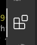
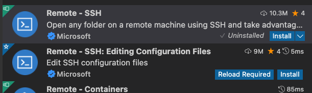
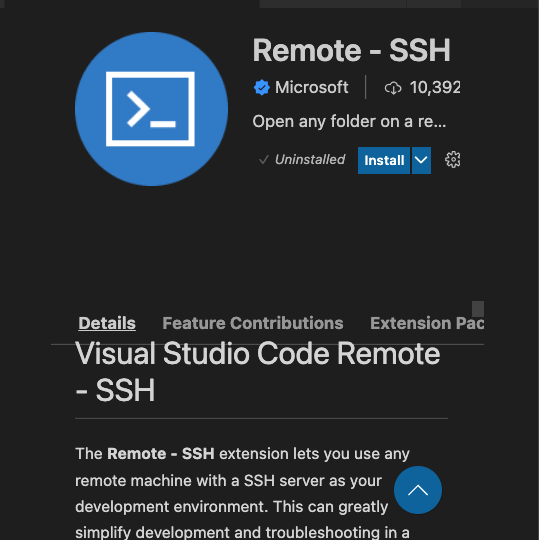
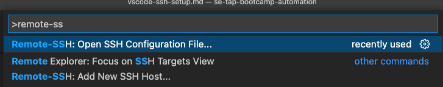
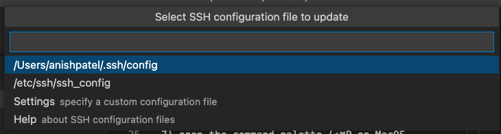
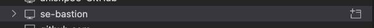
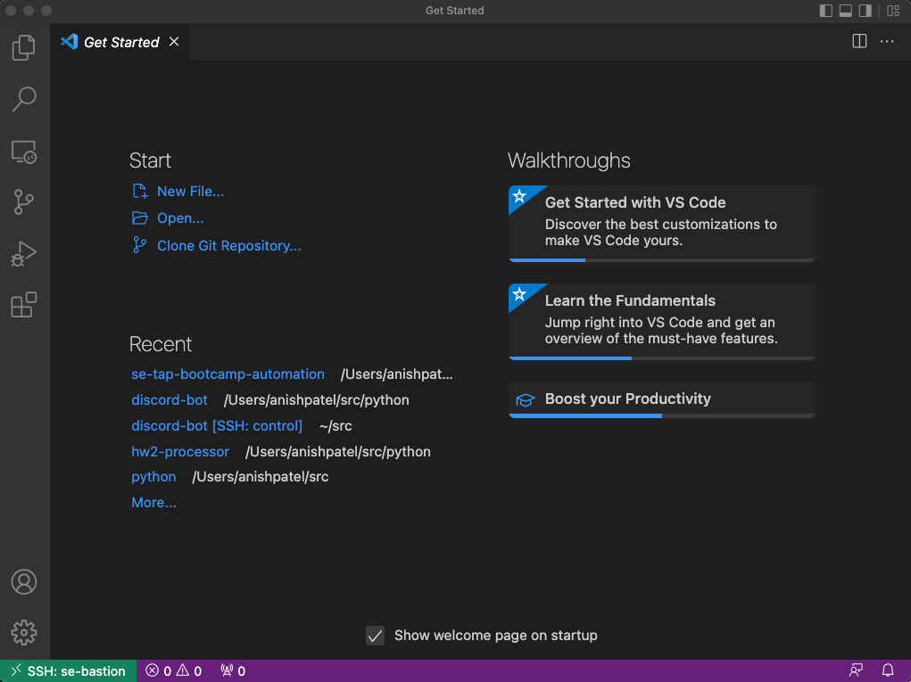
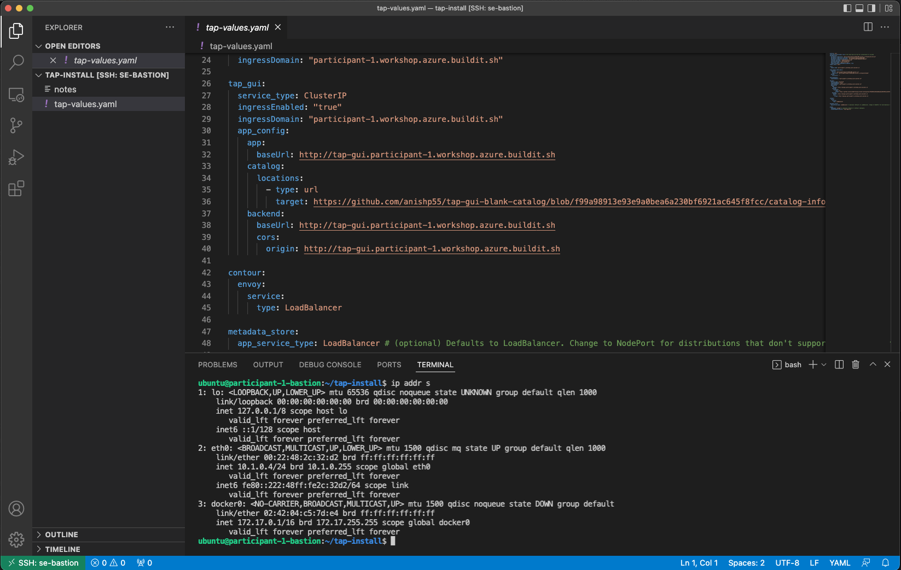

# Using remote ssh with VScode

## Requirements

* [Visual Studio Code](https://code.visualstudio.com/)

### Steps

1) Open VS Code

2) In the left hand bar, click the Extensions icon, press ⇧⌘X on MacOS, or ctrl+shift+X on Windows.

    

3) In the search bar type ```Remote SSH```

    

    This should return a few items.  We want to install:

    * `Remote - SSH`
    * `Remote - SSH: Editing Configuration Files`

4) Select the ```Remote - SSH``` extension and click on install.

    

5) Do the same for the ```Remote - SSH: Editing Configuration Files```

6) Restart VS Code if needed

7) Open the command palette (⇧⌘P on MacOS, ctrl+shift+p on Windows), and type ```Remote SSH```
command-palette-ssh

    

    Select the Remote-SSH: Open SSH Configuration File...

8) Open the `.ssh/config` file for your user (usually located in your home directory)

    

9) Add an entry for your bastion host.  Follow the format below and replace the `<>` with your path to keys, hostname, and host

    ```bash
        Host <friendly name>
            HostName <host or ip>
            User ubuntu
            PreferredAuthentications publickey
            IdentityFile <path to ssh key>
    ```

10) To access our remote host, click the remote explorer icon in the left bar

    

11) Find the host, and click on the folder to open a new code window

    

12) This will open a new vscode window that is SSH'd into the bastion host

    

13) You can use this VS Code as you would on on your local host, clicking on open will let you open a location on the bastion host.  You also have terminal access on the bastion.

    